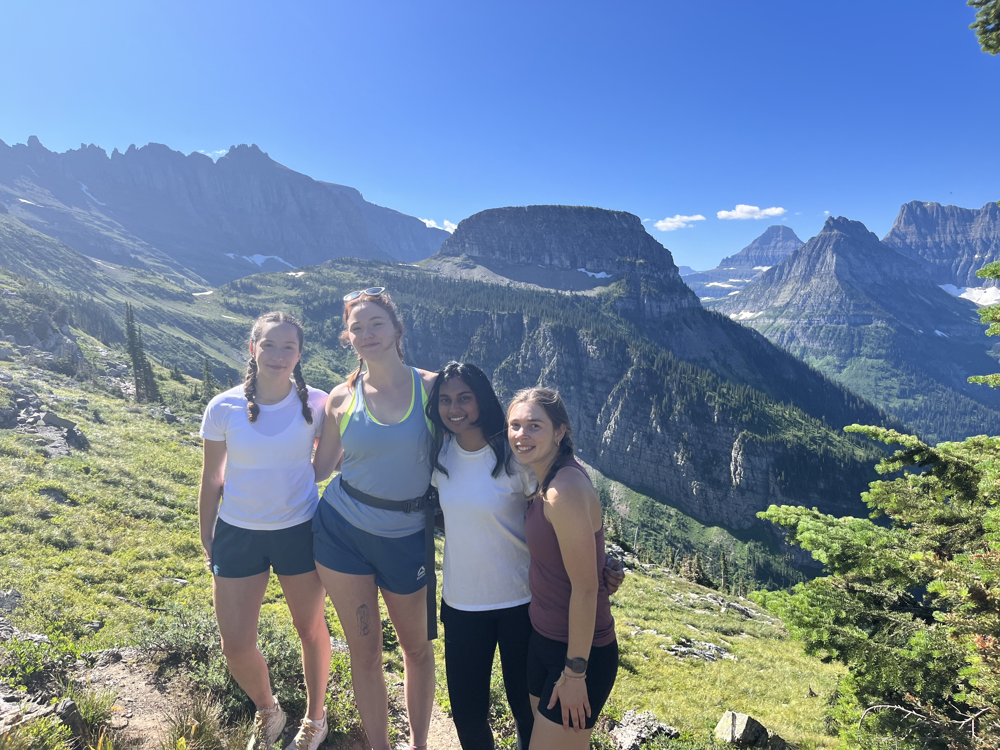

```{r setup, include=FALSE}
knitr::opts_chunk$set(echo = FALSE, warning = FALSE, message = FALSE)
source("Setup.R")
```

```{r}
# Install the necessary packages


# Load the libraries
library(tmap)
library(sf)
library(usmap)
library(raster)
library(terra)


```

```{r}
# Load US map data
us_map <- usmap::us_map()

# Convert it to an 'sf' (Simple Features) object for compatibility with tmap
us_sf <- st_as_sf(us_map)
tmap_mode("view")

```
# Map of States and National Park
This map illustrates all fifty States within the United States (and Washingting DC) and it is categorized into states where I have lived in for more than a month, states I have travel to, and states I have not traveled to yet. This map also show ten out of sixty-tree National Parks that I have been to. 
```{r}
# Example dataset of national parks (with lat/lon)
national_parks <- data.frame(
  name = c("Yellowstone", "Yosemite", "Gateway Arch", "Joshua Tree", "Mammoth Cave", "Mount Rainier", "Rocky Mountain", "Saguaro", "Sequoia", "Redwood"),
  latitude = c(44.4280, 37.8651, 38.6247, 33.8734, 37.1811, 46.8523, 40.3428, 32.3511, 36.5785, 41.2132 ),
  longitude = c(-110.5885, -119.5383, -90.1848, -115.9010, -86.1000, -121.7603, -105.6836, -111.2137, -118.2923, -124.0046)
)

# Convert national parks data to an sf object
national_parks_sf <- st_as_sf(national_parks, coords = c("longitude", "latitude"), crs = 4326)

# Get the US map as an sf object
us_map <- usmap::us_map()
us_sf <- st_as_sf(us_map)

# Define the states categories (assuming these vectors already exist)
states_been_to <- c("AL", "NY", "FL", "AZ", "CT", "GA", "ID", "IL", "IN", "IA", "KS", "KY", "LA", 
                    "MA", "MO", "MT", "NV", "NC", "PA", "RI", "SC", "SD", "TN", "OR", "UT", "VT", "WA", 
                    "WV", "WI", "MS", "DC")  # Adding Mississippi

states_lived_in <- c("CA", "NY", "VA", "NJ", "WA", "OH", "MN", "NH", "CO")
states_no <- c("AK", "AR", "DE", "HI", "ME", "MD", "MA", "MI", "NE", "NM", "ND", "OK", "TX", "WY")

# Create a new column to categorize each state based on the abbreviation (abbr column)
us_sf$highlight <- "other"  # Default category for all states
us_sf$highlight[us_sf$abbr %in% states_been_to] <- "been"
us_sf$highlight[us_sf$abbr %in% states_lived_in] <- "lived"
us_sf$highlight[us_sf$abbr %in% states_no] <- "no"

```


```{r}
tm_shape(us_sf) + 
  tm_borders("white") + 
  tm_fill(col = "highlight", palette = c("been to" = "seagreen", "lived in" = "mediumvioletred", "no yet" = "tan"), legend.show = FALSE) + 
  tm_shape(national_parks_sf) + 
  tm_symbols(size = 0.3, col = "cornflowerblue", shape = 21, scale = 1.5) + 
  tm_text(text = "name", size = 0.75, col = "black", shadow = TRUE) +  
  tm_layout(title = "Penny's US Travels - by state and national park") +
  tm_shape(national_parks_sf) + 
  tm_bubbles(size = 0.4, col = "cornflowerblue", popup.vars = c("name")) +
  tm_add_legend(type = "fill", col = c("seagreen", "mediumvioletred", "tan"), labels = c("Been To", "Lived In", "Not Yet"))  # Add a legend

```

## Author's Note
This map is for the personal use of Penny Hunter as I travels to more and more states and national parks. Motivation for this project came from a recent purchase of the America the Beautiful pass. This give free entry to all national parks for one year. This tool will allow me to track which parks I travel to this year and where they are located.
```{r}

```

